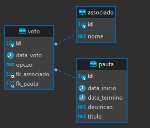

# projeto-votacao

### Instruções:
1. Fazer o clone do projeto
2. Iniciar uma instância MySQL e colocar essas informações no arquivo `application-dev.properties`
3. Alterar o perfil ativo do spring para `dev`
4. Se certificar que está usando java 17 em sua IDE
5. Utilizar o comando `mvn clean install` com perfil `dev`
6. Iniciar a aplicação

### URLs:
- Aplicação: http://localhost:8080/
- Swagger: http://localhost:8080/swagger-ui/index.html#/

